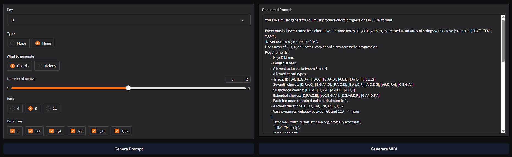
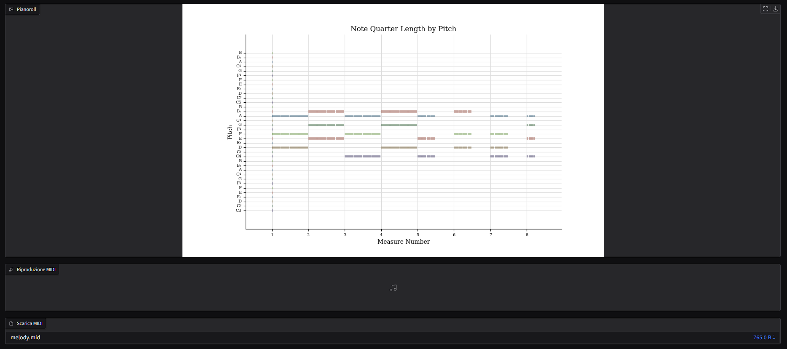

# MeloChords-Generator

**MeloChords-Generator** is an innovative tool designed to facilitate music creation through the integration of advanced language models (LLMs) and MIDI generation. The project provides an intuitive graphical user interface (GUI) that allows both beginners and experienced musicians to generate melodies and chord progressions in MIDI format.  

## Description

MeloChords-Generator enables users to:  
- Create textual prompts and send them to a language model (LLM) to generate musical ideas;   
- Automatically generate MIDI melodies or chord progressions;  
- Visualize, listen to, and download the generated musical content directly from the interface.  

The project aims to achieve two main objectives:  
1. Make music creation more accessible to users with limited knowledge of music theory;  
2. Support music producers during creative blocks by providing inspiration and immediately usable material.

This project leverages the following technologies:  

[](https://www.python.org/)
[](https://gradio.app/)
[](https://lmstudio.ai/)  
[](https://mido.readthedocs.io/)
[](https://web.mit.edu/music21/)
[](https://www.pygame.org/)
[](https://matplotlib.org/)
[](https://docs.python-requests.org/)

## Installation & Setup

To run **MeloChords-Generator**, follow these steps:

### 1. Install LM Studio
Download and install [LM Studio](https://lmstudio.ai/) on your machine.

### 2. Install the LLM
If you want to use the model employed in this project, install the **qwen3-4b-2507** model:

### 3. Enable API
1. Go to the **Developer** section in LM Studio.
2. Activate the LLM to enable the API endpoint.

### 4. Configure Inference Settings
1. Navigate to the **Inference** panel.
2. Set the following parameters:  
   - **Temperature:** 0.8  
   - **Top K Sampling:** 60  
   - **Repeat Penalty:** 1.2

### 5. Enable Structured Output
1. Activate **Structured Output**.
2. Insert the following JSON schema:

```json
{
  "schema": "http://json-schema.org/draft-07/schema#",
  "title": "Melody",
  "type": "object",
  "properties": {
    "melody": {
      "type": "array",
      "items": {
        "type": "object",
        "properties": {
          "bar": {
            "type": "integer",
            "minimum": 1
          },
          "notes": {
            "type": "array",
            "items": {
              "type": "object",
              "properties": {
                "note": {
                  "type": [
                    "string",
                    "array"
                  ],
                  "pattern": "^[A-Ga-g][#b]?[0-9]$"
                },
                "duration": {
                  "type": "string",
                  "pattern": "^(1/1|1/2|1/4|1/8|1/16|1/32)$"
                },
                "velocity": {
                  "type": "integer",
                  "minimum": 0,
                  "maximum": 127
                }
              },
              "required": [
                "note",
                "duration",
                "velocity"
              ]
            }
          }
        },
        "required": [
          "bar",
          "notes"
        ]
      }
    }
  },
  "required": [
    "melody"
  ]
}
```

### 6. Install Python Dependencies
Before running the project, install all required Python libraries:

```bash
pip install gradio mido music21 pygame matplotlib requests
```
## Usage

To start using **MeloChords-Generator**, follow these steps:

1. Ensure all dependencies are installed and LM Studio is properly configured as described in the **Installation & Setup** section.

2. Launch the application by running the main GUI script:

```bash
python GUI.py
```
The graphical interface will open automatically. From there, you can:

- **Select** the musical **Key** and **Type** (Major/Minor).  
- **Choose** what to generate (**Melody** or **Chords**).  
- **Set** the number of **octaves** and **bars**.  
- **Select** allowed **durations** for the musical events.  
- **Click** the **Generate Prompt** button to create a prompt based on your settings.  
- **Click** the **Generate MIDI** button to send the prompt to the LLM and generate the corresponding MIDI file.  
- The generated MIDI will be displayed as a **pianoroll**, and you can **listen** to it or **download** the file directly from the interface.




## Metrics Evaluation

If you want to compute metrics for the generated files:

- For melodies, use the **tester.py** script.  
- For chord progressions, use the **ChordTest.py** script.

### Evaluation Procedure

For the tests reported here:

- Five melody prompts and five chord progression prompts were created using **MeloChords-Generator**.  
- For each prompt, one was sent directly to **Qwen** via the application.  
- The other was sent to **ChatGPT**, and the response was then used to create the corresponding MIDI file.  

The metrics shown in the tables above were computed from the resulting MIDI files.


### Melodies Metrics Comparison

### Melodies Metrics Comparison

| Qwen Mean | Qwen Std Dev | Metric                     | GPT Mean | GPT Std Dev |
|:---------:|:------------:|:--------------------------:|:--------:|:-----------:|
| 27.00     | 13.71        | Ambitus (Range)            | 23.00    | 15.75       |
| 3.68      | 0.63         | Pitch Entropy              | 3.36     | 0.79        |
| 0.16      | 0.06         | Motif Repetition (3-gram) | 0.18     | 0.08        |
| 34.40     | 6.27         | Melodic Contour -- Ascending | 32.40  | 7.50        |
| 13.00     | 4.42         | Melodic Contour -- Descending | 16.40 | 5.81        |
| 2.00      | 4.47         | Melodic Contour -- Repeated | 2.00   | 4.47        |
| 1.00      | 0.00         | Tonal Compliance           | 1.00     | 0.00        |
| 0.56      | 0.11         | Note Duration Dist. (0.5)  | 0.45     | 0.21        |
| 0.19      | 0.08         | Note Duration Dist. (1.0)  | 0.36     | 0.20        |
| 0.20      | 0.12         | Note Duration Dist. (2.0)  | 0.16     | 0.09        |
| 0.11      | 0.05         | Note Duration Dist. (0.25) | 0.15     | 0.00        |

### Chord Progression Metrics Comparison

| Qwen Mean | Qwen Std Dev | Metric           | GPT Mean | GPT Std Dev |
|:---------:|:------------:|:----------------:|:--------:|:-----------:|
| 0.7574    | 0.0825       | Chord Coverage   | 0.7534   | 0.0933      |
| 4.1351    | 0.1447       | Chord Entropy    | 4.1512   | 0.1592      |
| 1.0000    | 0.0000       | Tonal Compliance | 1.0000   | 0.0000      |
| 0.5042    | 0.0373       | Harmonic Rhythm  | 0.5125   | 0.0316      |
| 42.4000   | 9.2087       | Ambitus          | 39.4000  | 12.7593     |

---
## Developed with ❤️ by [Daniele Salerno](https://github.com/DanieleSalerno)

  
